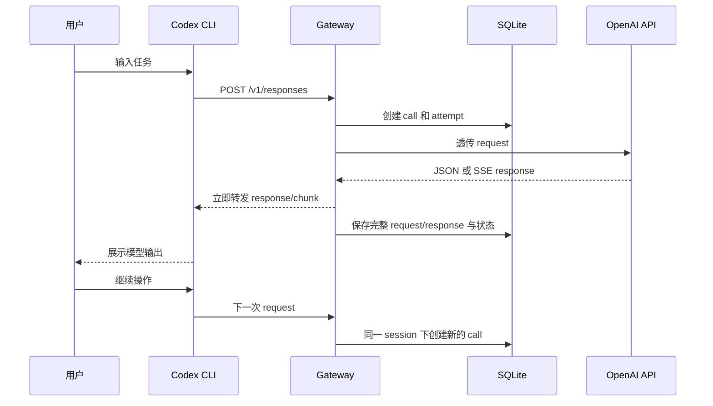
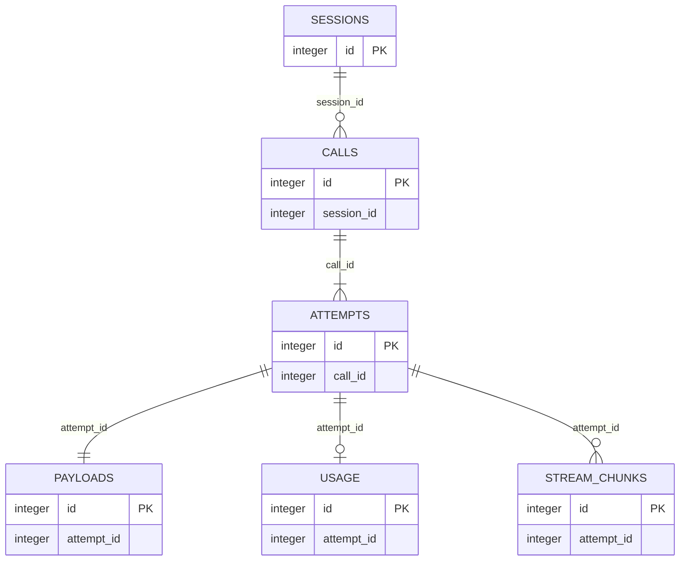

# PromptHarbor 技术方案

## 1. 目标

构建一个运行在本机的透明网关，观察 Codex CLI 发往 OpenAI API 的完整 request，以及 OpenAI 返回给 Codex 的完整 response。网关应尽量不改变 Codex 的行为，尤其是流式输出的时序和内容。

## 2. MVP 范围

### 支持

- 目标客户端：Codex CLI
- 上游协议：OpenAI API
- OpenAI Responses API，以及 Codex 实际使用到的 OpenAI API endpoint
- JSON 请求/响应
- SSE 流式响应
- 本机单用户运行
- SQLite 本地存储
- 完整保存 prompt、response、请求/响应头（认证信息除外）
- 请求头中的 `Authorization` 透传到上游，但不写入数据库或日志
- 事件按时间保留 2 天，并自动清理过期数据
- 纯文字 CLI：启动、查看调用列表、查看详情、清理数据

### 不支持

- Claude Code、pi
- 多用户、远程部署、Docker 部署
- Web UI
- 请求修改
- 自动重试
- 模型切换
- 路由和负载均衡
- MVP 阶段的数据脱敏

## 3. 使用方式

网关默认监听本机地址：

```text
http://127.0.0.1:8787
```

启动 Codex 时将 OpenAI base URL 指向网关：

```bash
OPENAI_BASE_URL=http://127.0.0.1:8787/v1 codex
```

网关收到 `POST /v1/...` 后，使用配置的上游地址保留原路径转发，例如：

```text
http://127.0.0.1:8787/v1/responses
        ↓
https://api.openai.com/v1/responses
```

客户端的 `Authorization` 只在内存中透传给上游，不由网关读取、持久化或打印。

## 4. 核心行为

1. 接收 Codex 请求并生成唯一 event ID。
2. 记录请求到达时间、HTTP 方法、路径、请求头（排除认证信息）、请求 body 和流式标记。
3. 将请求转发到 OpenAI。
4. 对普通响应直接转发；对 SSE 响应边读取边写回客户端，同时复制响应内容用于记录。
5. 记录状态码、响应头（排除认证信息）、完整 response body、首字节时间、完成时间和错误信息。
6. 上游连接中断、客户端取消、网关异常都要留下可查询的失败事件。
7. 每次启动和定期运行清理任务，删除超过 2 天的事件及其 body。

## 5. 数据模型

### events

- `id`：UUID
- `created_at`
- `started_at`
- `first_byte_at`：可为空
- `completed_at`：可为空
- `method`
- `path`
- `model`：从请求 JSON 提取，可为空
- `stream`：布尔值
- `status_code`：可为空
- `request_headers_json`
- `response_headers_json`
- `request_body`
- `response_body`
- `error`
- `bytes_in`
- `bytes_out`

body 在 MVP 中直接存 SQLite。实现应设置单事件大小上限和数据库大小保护，避免异常响应耗尽磁盘。

## 6. CLI

建议命令：

```text
uv run python -m prompt_harbor start [--listen 127.0.0.1:8787] [--upstream https://api.openai.com]
uv run python -m prompt_harbor list [--since 2d] [--limit 50]
uv run python -m prompt_harbor show <event-id>
uv run python -m prompt_harbor purge
```

`list` 显示时间、路径、模型、状态、耗时、输入/输出大小和 event ID。`show` 显示完整请求与响应内容，并明确标识流式响应和错误。

运行时配置支持当前目录的 `prompt-harbor.ini`，也可通过 `--config` 或 `PROMPT_HARBOR_CONFIG` 指定文件。覆盖优先级为 CLI 参数、环境变量、INI 文件、内置默认值。配置文件使用 `[gateway]` 和 `[sidecar]` 两个 section；默认值和可配置项见 `prompt-harbor.ini.example`。

## 7. 性能与正确性要求

- SSE chunk 转发不等待完整响应。
- 网关自身处理不主动缓冲完整 SSE 响应后再发送。
- 记录操作不得阻塞转发；必要时使用内存缓冲和独立写入队列。
- 保留上游状态码、关键响应头和响应字节内容。
- 客户端取消时及时关闭上游连接并完成失败事件记录。
- 用 OpenAI JSON 和 SSE fixtures 覆盖透明转发、错误、取消和过期清理。

## 8. 安全与限制

- 只绑定 `127.0.0.1`。
- 不持久化 API key，不在 CLI 输出 API key。
- MVP 不做 prompt 内容脱敏；完整内容只保存在本机 SQLite，按 2 天策略清理。
- 不接受来自局域网或公网的连接。

## 9. UI

已提供独立无依赖页面 `ui/index.html`，参考 `~/project/session-share` 的深色侧栏和卡片式布局，包含 Overview、Calls、Sessions 导航及响应式布局，通过 `GET /api/overview` 读取数据。


## 10. 主键与关联约定

所有表使用 SQLite 自增整数主键：`id INTEGER PRIMARY KEY AUTOINCREMENT`。

表之间不创建 SQLite 外键约束。`session_id`、`call_id`、`attempt_id` 只由业务代码维护；写入、查询和级联删除均由应用层负责。

## 11. Session 期间的完整链路



## 12. 数据表 ER 图（逻辑关联）

图中的关联是业务逻辑关系，不是 SQLite 外键约束。



MVP 启用 `sessions`、`calls`、`attempts`、`payloads` 和 `usage`；`stream_chunks` 作为后续扩展，默认不逐 chunk 持久化。

## 13. 当前实现约定

实现代码位于 `prompt_harbor/`，按配置、数据库、代理、headers、usage、保留策略和 CLI 分模块组织；`prompt_harbor.py` 提供命令行入口。推荐运行方式为 `uv run python -m prompt_harbor ...`。

请求和响应默认最多各保存 10 MiB，可通过 `PROMPT_HARBOR_MAX_BODY` 调整。超过限制时只保存前缀，并将对应的 `request_truncated` 或 `response_truncated` 设为 1；`response_complete` 表示上游传输是否完整，和 HTTP 状态码无关。
